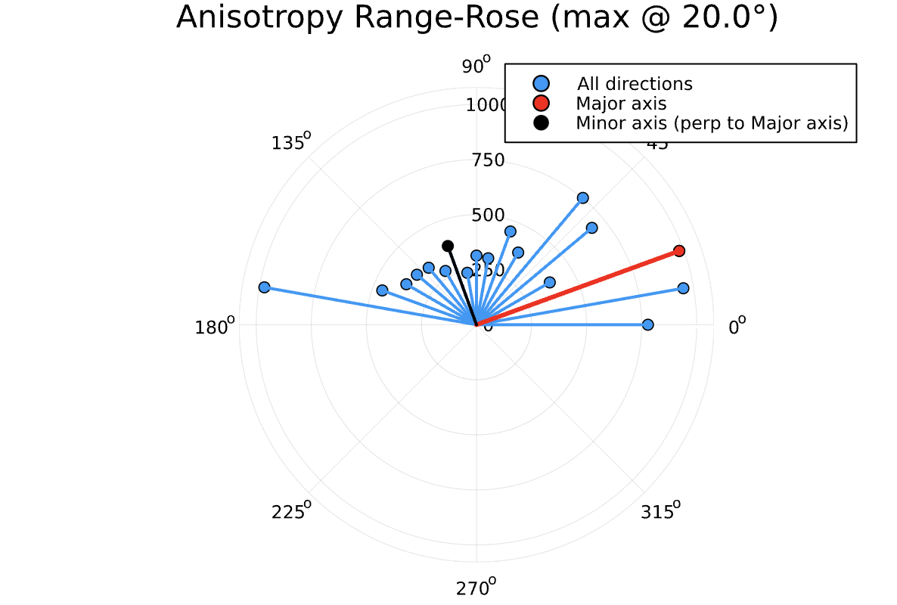

# VariogramVerify.jl

NOTE: this repo is under active development...

`VariogramVerify.jl` is a Julia package built on `GeoStats.jl` for systematically computing variograms at multiple angles in search for the most appropriate major and minor axes directions for geostatistical interpolation.  This allows user input at the critical interpolation stage of variogram modeling and selection.

One intended use case is in  [Stanford-Mineral-X/MultiGrid.jl](https://github.com/Stanford-Mineral-X/MultiGrid.jl).

## Installation
```
using VariogramVerify
```

## Example


## How to Contribute

This package is being actively developed
[here](https://github.com/jharlanr/VariogramVerify.jl).

If you would like to add new functionality, we welcome new contributions from
anyone as pull requests on [our Github repo](https://github.com/jharlanr/VariogramVerify.jl).

No contribution is too small, and we also welcome requests for new features
or bug reports. To contribute to `sat-tile-stack` this way, please 
[open an issue on GitHub](https://github.com/jharlanr/VariogramVerify.jl/issues).
